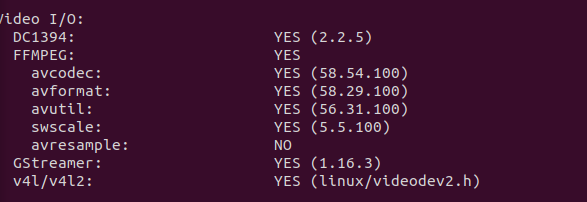

# OpenFace Setup Instructions for Action Recognition Application

Unfortunately, the provided install script in the standard OpenFace repository doesn't work properly in the environments we have at the lab (Ubuntu > 20.00.00). Therefore, we will have to install the dependencies manually. You will need superuser rights for the installation. 

If during the installation any command `<comand_example>` displays the message `permission denied` (or similar), just replace `<comand_example>`  with `sudo <comand_example>` and continue with the installation. 

## Step-by-Step Instructions

### 1. Clone the GitHub Repository

```sh
git clone https://github.com/SantiPhys/action_recognition_tool.git
cd action_recognition_tool/headpose
```

### 2. Install GStreamer

```sh
sudo apt-get install gstreamer1.0*
sudo apt install ubuntu-restricted-extras
sudo apt install libgstreamer1.0-dev libgstreamer-plugins-base1.0-dev
```

### 3. Advanced Ubuntu Installation of OpenFace

The installation instructions were adapted from [OpenFace's wiki](https://github.com/TadasBaltrusaitis/OpenFace/wiki/Unix-Installation) with slight modifications. OpenFace requires `cmake`, OpenCV 4.0.0 (or newer), OpenBLAS, dlib, and a C++17 compiler (with optional dependencies `tbb` and `boost`).

#### 3.1 Install GCC

```sh
sudo apt-get update
sudo apt-get install build-essential
sudo apt-get install g++-8
```

#### 3.2 Install CMake

```sh
sudo apt-get install cmake
```

**Note:** For Ubuntu 16.04 or lower, CMake version required by OpenFace is at least 3.8, and Ubuntu 16.04 apt-get only supports up to CMake 3.5. To install a newer version of CMake:

```sh
sudo apt-get --purge remove cmake-qt-gui -y
sudo apt-get --purge remove cmake -y
mkdir -p cmake_tmp
cd cmake_tmp
wget https://cmake.org/files/v3.10/cmake-3.10.1.tar.gz
tar -xzvf cmake-3.10.1.tar.gz -qq
cd cmake-3.10.1/
./bootstrap
make -j4
sudo make install
cd ../..
sudo rm -rf cmake_tmp
```

#### 3.3 Install OpenBLAS

```sh
sudo apt-get install libopenblas-dev
```

#### 3.4 Install OpenCV 4.1.0

##### 3.4.1 Install OpenCV Dependencies

```sh
sudo apt-get install git libgtk2.0-dev pkg-config libavcodec-dev libavformat-dev libswscale-dev
sudo apt-get install python-dev python-numpy libtbb2 libtbb-dev libjpeg-dev libpng-dev libtiff-dev libdc1394-22-dev
```

##### 3.4.2 Download and Unzip OpenCV

```sh
wget https://github.com/opencv/opencv/archive/4.1.0.zip
unzip 4.1.0.zip
rm 4.1.0.zip
cd opencv-4.1.0
mkdir build
cd build
```

##### 3.4.3 Build and Install OpenCV

```sh
sudo cmake -D CMAKE_BUILD_TYPE=RELEASE -D CMAKE_INSTALL_PREFIX=/usr/local -D BUILD_TIFF=ON -D WITH_TBB=ON ..
```
Make sure that during this step the terminal displays `GStreamer : YES` like so:



Then, continue with:

```sh
sudo make -j2
sudo make install
```


#### 3.5 Download and Compile dlib

```sh
wget http://dlib.net/files/dlib-19.13.tar.bz2
tar xf dlib-19.13.tar.bz2
cd dlib-19.13
mkdir build
cd build
cmake ..
cmake --build . --config Release
sudo make install
sudo ldconfig
cd ../..
```

#### 3.6 Install Boost (Optional)

```sh
sudo apt-get install libboost-all-dev
```

### 4. Install OpenFace

#### 4.1 Clone OpenFace Repository

```sh
git clone https://github.com/TadasBaltrusaitis/OpenFace.git
cd OpenFace
mkdir build
cd build
```

#### 4.2 Compile OpenFace

```sh
cmake -D CMAKE_CXX_COMPILER=g++-8 -D CMAKE_C_COMPILER=gcc-8 -D CMAKE_BUILD_TYPE=RELEASE ..
make
```

### 5. Download C++ Models for OpenFace

Download the models from the following Google Drive links and place them in the `OpenFace/build/bin/model/patch_experts` directory:

- [scale 0.25](https://drive.google.com/uc?export=download&id=1TM_L_qNgd513z5i_T4CuXOF1Vl5DDu1l)
- [scale 0.35](https://drive.google.com/uc?export=download&id=1o2DmUO7jzjIbimsRXmjbNilPl_pcHvnJ)
- [scale 0.50](https://drive.google.com/uc?export=download&id=1bo0TAEH-2j8feBb3nYKPk5k0ODgfpEPz)
- [scale 1.00](https://drive.google.com/uc?export=download&id=1b8semX96A2yNe194PvKh_rkU1frcI4jr)

### 6. Test OpenFace Installation

OpenFace should now be successfully installed in the directory `headpose/opencv-4.1.0/build/OpenFace/`. The executables should be in the directory `headpose/opencv-4.1.0/build/OpenFace/build/bin`.

To verify the installation, run the following commands from the `headpose/opencv-4.1.0/build/OpenFace/build` directory:

#### For Videos

```sh
./bin/FaceLandmarkVid -f "../samples/changeLighting.wmv" -f "../samples/2015-10-15-15-14.avi"
```

#### For Images

```sh
./bin/FaceLandmarkImg -fdir "../samples/" -wild
```

#### For Multiple Faces in Videos

```sh
./bin/FaceLandmarkVidMulti -f ../samples/multi_face.avi
```

#### For Feature Extraction

```sh
./bin/FeatureExtraction -verbose -f "../samples/default.wmv"
```

## Conclusion

Following these steps will help you set up the environment for the action recognition application.
